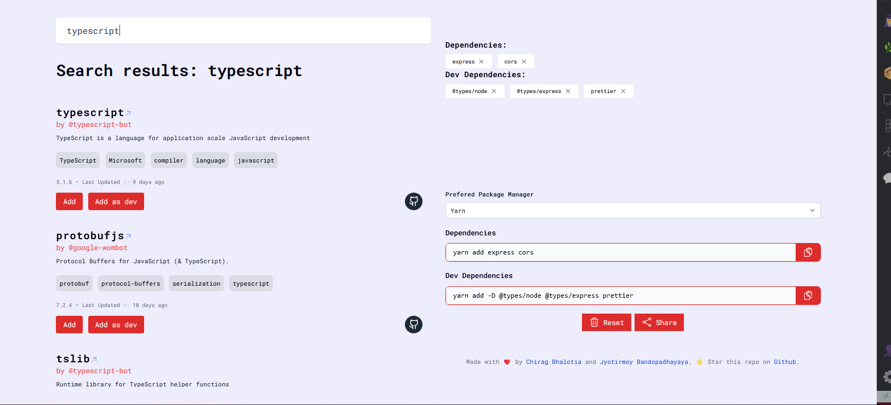

<h1 align="center"> npm-ez-dependency-adder </h1>

<p align="center">
    
</p>




## 📝 Description

npm-ez-dependency-adder is a platform meant to select add npm packages to your project with ease. This platform is built using Nextjs. (Not responsive currently)

## 🛠️ Technologies Used

-   Node.js
-   Next.js
-   Tailwind CSS

## 🚀 Features

-   Select multiple dependencies as you like

## 🎁 Project Setup

### To run the development server

-   In the project root run the following command to install the dependencies

```
yarn
```

or

```
npm install
```

-   and then to start the development server

```
yarn dev
```

or

```
npm run dev
```

## 📝 License

This project is licensed under the ISC License.

For more information, please see the `LICENSE` file.
